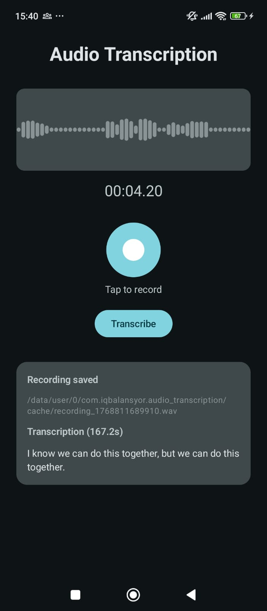
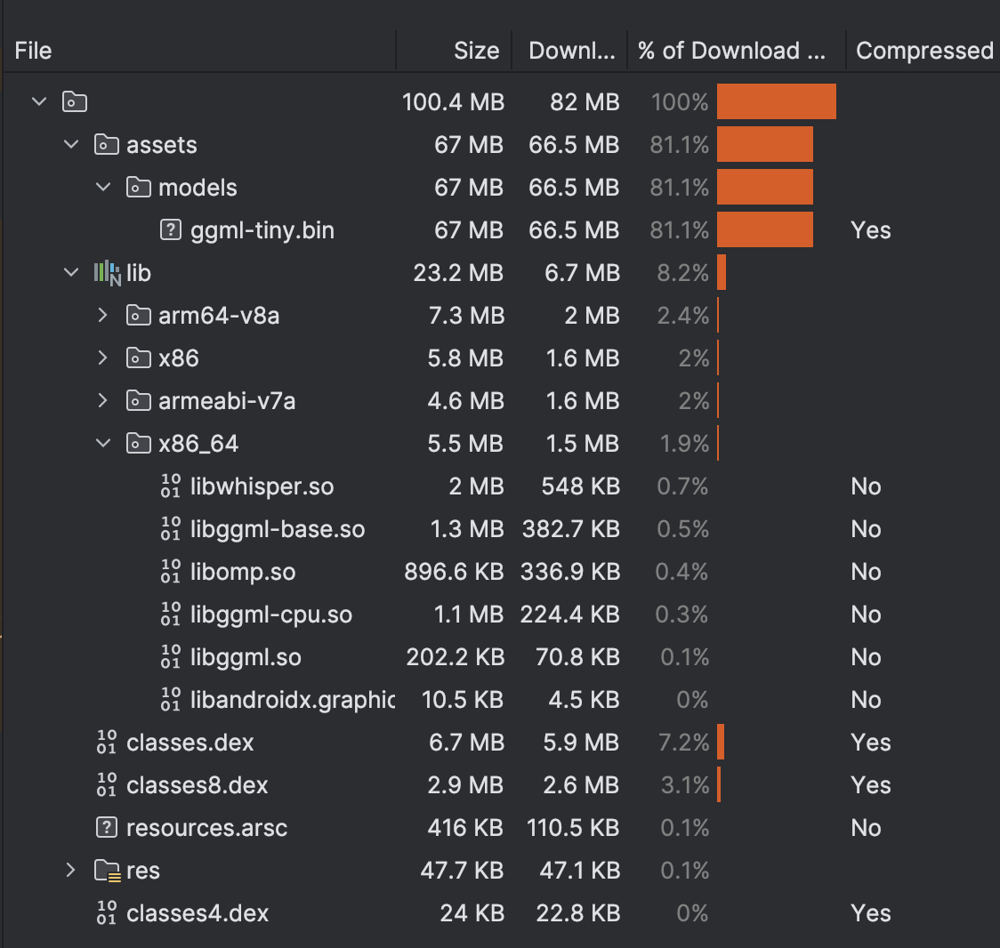

# Audio Transcription

An Android app for offline speech-to-text transcription using [Whisper.cpp](https://github.com/ggml-org/whisper.cpp).

## Preview

<p align="center">
  
</p>

## Features

- Record audio directly from the microphone
- Real-time audio waveform visualization
- Offline transcription using Whisper AI model
- No internet connection required
- Transcription duration tracking

## Tech Stack

| Component | Technology |
|-----------|------------|
| Language | Kotlin |
| UI Framework | Jetpack Compose |
| Architecture | MVVM (ViewModel + StateFlow) |
| Audio Recording | AudioRecord API (16kHz, Mono, PCM 16-bit) |
| ML Model | [Whisper.cpp](https://github.com/ggml-org/whisper.cpp) (ggml-tiny) |
| Native Integration | JNI / NDK / CMake |
| Min SDK | 24 (Android 7.0) |
| Target SDK | 36 |

## How It Works

```
Your Voice → WAV File → Whisper Model → Text Output
 (Sound)     (Numbers)   (Neural Net)
```

The app records audio, converts it to numbers, and feeds it through the Whisper neural network which predicts text word by word.

📖 **[See detailed explanation →](docs/HOW_TRANSCRIPTION_WORKS.md)**

## Model

This app uses the **Whisper Tiny** model from [whisper.cpp](https://github.com/ggml-org/whisper.cpp), a C/C++ port of OpenAI's Whisper automatic speech recognition model.

- **Model**: `ggml-tiny.bin`
- **Size**: ~74 MB
- **Format**: GGML (quantized)
- **Inference**: Runs entirely on-device (CPU)

## APK Size Breakdown

<p align="center">
  
</p>

| Component | Size |
|-----------|------|
| **Total APK** | ~100 MB (82 MB download) |
| Model (`ggml-tiny.bin`) | 67 MB (81.1%) |
| Native libraries | 23 MB (8.2%) |
| DEX files | ~10 MB |

> The model file accounts for most of the APK size. Consider using a model download approach for production apps.

## Project Structure

```
app/
├── src/main/
│   ├── assets/models/       # Whisper model (ggml-tiny.bin)
│   ├── java/.../
│   │   ├── MainActivity.kt
│   │   ├── AudioRecorderViewModel.kt
│   │   ├── media/
│   │   │   ├── Recorder.kt         # WAV audio recorder
│   │   │   └── RiffWaveHelper.kt   # WAV encoding/decoding
│   │   └── ui/
│   │       ├── screens/
│   │       └── components/
whisper/
├── src/main/
│   ├── java/.../whisper/
│   │   ├── LibWhisper.kt           # Kotlin JNI wrapper
│   │   └── WhisperCpuConfig.kt     # CPU thread optimization
│   └── jni/whisper/
│       ├── jni.c                   # JNI bridge
│       └── CMakeLists.txt          # Native build config
```

## Requirements

- Android Studio Arctic Fox or newer
- NDK 25.1.8937393
- CMake 3.10+
- [whisper.cpp](https://github.com/ggml-org/whisper.cpp) source (for native build)

## Building

1. Clone this repository
2. Clone [whisper.cpp](https://github.com/ggml-org/whisper.cpp) to a known location
3. Update the path in `whisper/src/main/jni/whisper/CMakeLists.txt`:
   ```cmake
   set(WHISPER_LIB_DIR /path/to/whisper.cpp)
   ```
4. Open in Android Studio and sync Gradle
5. Build and run

## License

MIT License

## Acknowledgments

- [whisper.cpp](https://github.com/ggml-org/whisper.cpp) - C/C++ port of OpenAI's Whisper
- [OpenAI Whisper](https://github.com/openai/whisper) - Original Whisper model
